# TP2 DPBO 2025/2026

## Data Diri

| Keterangan  | Isi                                       |
| ----------- | ----------------------------------------- |
| Nama        | Fakhri Fauzan                             |
| NIM         | 2501536                                   |
| Kelas       | C2                                        |
| Mata Kuliah | Desain dan Pemrograman Berorientasi Objek |

---

# Janji

Saya Fakhri Fauzan dengan NIM 2501536 mengerjakan Tugas Praktikum 2 dalam mata kuliah Desain dan Pemrograman Berorientasi Objek untuk keberkahanNya maka saya tidak melakukan kecurangan seperti yang telah dispesifikasikan. Aamiin.

---

# Deskripsi Program

Program merupakan pengembangan dari **TP1**, yaitu sistem sederhana untuk mengelola data film bioskop.

Pada TP2, program dikembangkan menggunakan konsep **Multilevel Inheritance** dengan tiga class yang memiliki hubungan:

```text
KaryaSeni
    ↓
  Film
    ↓
FilmAnimasi
```

Ketiga class tersebut dibuat berdasarkan hubungan yang masuk akal dengan objek di dunia nyata.

- **KaryaSeni** merupakan class dasar yang merepresentasikan karya seni secara umum.
- **Film** merupakan turunan dari `KaryaSeni` karena film merupakan salah satu bentuk karya seni.
- **FilmAnimasi** merupakan turunan dari `Film` karena film animasi merupakan salah satu jenis film.

Program dibuat menggunakan empat bahasa pemrograman:

1. C++
2. Python
3. Java
4. PHP

Versi C++, Python, dan Java menggunakan **CLI (Command Line Interface)**, sedangkan versi PHP dibuat dalam bentuk **web** menggunakan HTML Form dan HTML Table.

Program memiliki lima object awal yang dibuat sebelum user memasukkan data tambahan. User kemudian dapat menambahkan object baru melalui input.

---

# Desain Program

## Relasi Antar Class

Program menggunakan konsep **Multilevel Inheritance**, yaitu inheritance yang memiliki lebih dari satu tingkat pewarisan.

Hubungan antar class adalah:

```text
KaryaSeni
    │
    │ inheritance
    ▼
  Film
    │
    │ inheritance
    ▼
FilmAnimasi
```

Hubungan tersebut dipilih berdasarkan karakteristik objek di dunia nyata:

```text
KaryaSeni
    └── Film
          └── Film Animasi
```

Dengan demikian, `Film` mewarisi atribut dan method dari `KaryaSeni`, sedangkan `FilmAnimasi` mewarisi atribut dan method dari `Film` sekaligus atribut dan method yang sebelumnya diwariskan oleh `KaryaSeni`.

---

# Desain Diagram

Design diagram dibuat menggunakan draw.io dan merepresentasikan hubungan inheritance serta atribut dan method dari ketiga class.

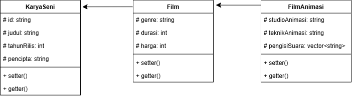

---

# Penjelasan Class

## 1. KaryaSeni

`KaryaSeni` merupakan **base class tingkat pertama** yang digunakan untuk menyimpan atribut yang bersifat umum dan dapat dimiliki oleh berbagai macam karya seni.

### Attribute

| Attribute    | Tipe    | Keterangan                     |
| ------------ | ------- | ------------------------------ |
| `id`         | String  | Identitas unik dari karya seni |
| `judul`      | String  | Judul karya seni               |
| `tahunRilis` | Integer | Tahun karya dirilis            |
| `pencipta`   | String  | Nama pencipta karya            |

Attribute pada class ini dibuat `protected` agar dapat digunakan secara langsung oleh class turunannya.

### Method

| Method                         | Keterangan                             |
| ------------------------------ | -------------------------------------- |
| Constructor                    | Menginisialisasi attribute `KaryaSeni` |
| Setter dan Getter `id`         | Mengubah dan mengambil ID              |
| Setter dan Getter `judul`      | Mengubah dan mengambil judul           |
| Setter dan Getter `tahunRilis` | Mengubah dan mengambil tahun rilis     |
| Setter dan Getter `pencipta`   | Mengubah dan mengambil pencipta        |
| `tampilkan_info()`             | Menampilkan informasi karya seni       |

---

## 2. Film

`Film` merupakan class turunan dari `KaryaSeni`.

Film tetap memiliki seluruh attribute yang berasal dari `KaryaSeni`, kemudian menambahkan attribute yang lebih spesifik untuk sebuah film.

### Attribute

| Attribute | Tipe    | Keterangan                  |
| --------- | ------- | --------------------------- |
| `genre`   | String  | Genre film                  |
| `durasi`  | Integer | Durasi film dalam menit     |
| `harga`   | Integer | Harga tiket film di bioskop |

Attribute tersebut dibuat `protected` agar dapat digunakan secara langsung oleh class `FilmAnimasi` sebagai class turunannya.

### Method

| Method                     | Keterangan                                                           |
| -------------------------- | -------------------------------------------------------------------- |
| Constructor                | Menginisialisasi attribute `Film` dan bagian object dari `KaryaSeni` |
| Setter dan Getter `genre`  | Mengubah dan mengambil genre                                         |
| Setter dan Getter `durasi` | Mengubah dan mengambil durasi                                        |
| Setter dan Getter `harga`  | Mengubah dan mengambil harga                                         |
| `tampilkan_info()`         | Menampilkan informasi film                                           |

---

## 3. FilmAnimasi

`FilmAnimasi` merupakan class turunan dari `Film`.

Karena `FilmAnimasi` merupakan sebuah film, maka class ini mewarisi seluruh attribute dari `Film` dan `KaryaSeni`. Selain itu, terdapat attribute khusus yang berkaitan dengan film animasi.

### Attribute

| Attribute       | Tipe              | Keterangan                                    |
| --------------- | ----------------- | --------------------------------------------- |
| `studioAnimasi` | String            | Studio yang memproduksi animasi               |
| `teknikAnimasi` | String            | Teknik yang digunakan dalam pembuatan animasi |
| `pengisiSuara`  | Array/List/Vector | Daftar pengisi suara utama                    |

Pada versi PHP terdapat satu attribute tambahan:

| Attribute     | Tipe   | Keterangan                              |
| ------------- | ------ | --------------------------------------- |
| `foto_produk` | String | Path file gambar film, khusus versi PHP |

### Method

| Method                            | Keterangan                                                             |
| --------------------------------- | ---------------------------------------------------------------------- |
| Constructor                       | Menginisialisasi attribute `FilmAnimasi` dan bagian object dari parent |
| Setter dan Getter `studioAnimasi` | Mengubah dan mengambil studio animasi                                  |
| Setter dan Getter `teknikAnimasi` | Mengubah dan mengambil teknik animasi                                  |
| Setter dan Getter `pengisiSuara`  | Mengubah dan mengambil daftar pengisi suara                            |
| `tampilkan_info()`                | Menampilkan seluruh informasi film animasi                             |

---

# Alasan Penggunaan `id` pada KaryaSeni

Attribute `id` ditempatkan pada class `KaryaSeni` karena ketiga class membutuhkan identitas unik.

Baik object `KaryaSeni`, `Film`, maupun `FilmAnimasi` dapat memiliki identitas masing-masing.

Karena `FilmAnimasi` merupakan turunan dari `Film`, dan `Film` merupakan turunan dari `KaryaSeni`, maka attribute `id` dapat diwariskan hingga ke `FilmAnimasi`.

Dengan demikian, tidak perlu membuat attribute `id` yang sama pada setiap class.

---

# Alasan Penggunaan `harga` pada Film

Attribute `harga` ditempatkan pada class `Film`, bukan pada `KaryaSeni`.

Hal tersebut karena `harga` yang digunakan dalam program merupakan **harga tiket bioskop**, sehingga lebih spesifik terhadap objek film.

Tidak semua karya seni memiliki harga tiket bioskop, sehingga attribute tersebut kurang tepat jika ditempatkan pada `KaryaSeni`.

---

# Encapsulation dan Access Modifier

Konsep **encapsulation** digunakan dengan membatasi akses langsung terhadap attribute.

Pada class `KaryaSeni` dan `Film`, beberapa attribute menggunakan access modifier `protected`.

## Mengapa menggunakan `protected`?

`protected` dipilih karena attribute tersebut masih diperlukan oleh class turunannya.

Contohnya:

```text
KaryaSeni
    │
    └── Film
```

Attribute seperti `id`, `judul`, dan `tahunRilis` berada pada `KaryaSeni`, tetapi masih dibutuhkan oleh `Film`.

Dengan menggunakan `protected`, class `Film` dapat mengakses attribute tersebut secara langsung.

Hal yang sama berlaku untuk `FilmAnimasi` yang dapat mengakses attribute `protected` dari `Film`.

Namun, attribute `protected` tidak dapat diakses secara langsung dari luar class, misalnya dari `main`.

Akses dari luar class tetap dilakukan melalui method seperti getter dan setter.

Secara sederhana:

```text
KaryaSeni
   │
   │ protected
   ▼
Film dapat mengakses langsung

Film
   │
   │ protected
   ▼
FilmAnimasi dapat mengakses langsung

main
   │
   └── tidak dapat mengakses langsung
       → menggunakan getter/setter
```

Dengan demikian, penggunaan `protected` tetap menjaga pembatasan akses sekaligus mempermudah class turunan menggunakan data yang diwariskan.

---

# Constructor dan Pewarisan

Setiap class memiliki constructor yang digunakan untuk menginisialisasi attribute object.

Pada class turunan, constructor parent juga dipanggil untuk menginisialisasi bagian object yang berasal dari parent.

Contoh pada C++:

```cpp
Film(...) : KaryaSeni(id, judul, tahunRilis, pencipta)
{
    ...
}
```

Initializer list tersebut digunakan untuk memanggil constructor dari `KaryaSeni`.

Hal ini berbeda dengan penggunaan `protected`.

### `protected`

Digunakan untuk menentukan **siapa yang boleh mengakses attribute secara langsung**.

### Initializer list

Digunakan untuk menentukan **bagaimana bagian object dari parent diinisialisasi ketika object child dibuat**.

Jadi, keduanya memiliki fungsi yang berbeda dan dapat digunakan secara bersamaan.

Pada PHP dan Java, pemanggilan constructor parent dilakukan menggunakan mekanisme masing-masing bahasa, sedangkan pada C++ digunakan initializer list.

---

# Method `tampilkan_info()`

Setiap class memiliki method `tampilkan_info()` untuk menampilkan informasi object.

Pada class turunan, method tersebut digunakan untuk menampilkan informasi yang lebih lengkap sesuai dengan attribute yang dimiliki oleh class tersebut.

Contohnya, `FilmAnimasi` menampilkan:

- ID
- Judul
- Tahun Rilis
- Pencipta
- Genre
- Durasi
- Harga
- Studio Animasi
- Teknik Animasi
- Pengisi Suara

Dengan demikian, seluruh informasi object dapat ditampilkan secara lengkap.

---

# Struktur Data

Object disimpan dalam struktur data yang sesuai dengan bahasa pemrograman masing-masing.

| Bahasa | Struktur Data                      |
| ------ | ---------------------------------- |
| C++    | `vector<FilmAnimasi>`              |
| Python | `list`                             |
| Java   | `ArrayList<FilmAnimasi>`           |
| PHP    | `array` dalam `$_SESSION['films']` |

Kelima object awal dimasukkan ke dalam struktur data tersebut sebelum program menerima input tambahan dari user.

---

# Lima Object Awal

Program memiliki lima object `FilmAnimasi` yang dibuat terlebih dahulu pada program.

Object tersebut adalah:

1. Demon Slayer: Mugen Train
2. Jujutsu Kaisen 0
3. Your Name
4. One Piece Film: Red
5. The Boy and the Heron

Kelima object tersebut sudah tersedia ketika program pertama kali dijalankan.

Setelah itu, user dapat menambahkan object `FilmAnimasi` baru melalui input.

---

# Fitur Program

Sesuai dengan ketentuan tugas, program memiliki fitur utama:

### 1. Menampilkan Data

Program menampilkan seluruh data object `FilmAnimasi`.

Karena `FilmAnimasi` merupakan turunan dari `Film` dan `KaryaSeni`, data dari ketiga level class ditampilkan secara lengkap dalam **satu tabel**.

### 2. Tambah Data

User dapat memasukkan data `FilmAnimasi` baru.

Data yang dimasukkan meliputi:

- ID
- Judul
- Tahun Rilis
- Pencipta
- Genre
- Durasi
- Harga
- Studio Animasi
- Teknik Animasi
- Pengisi Suara

Pada PHP terdapat tambahan:

- Foto Produk

---

# Tabel Dinamis

Tampilan seluruh data dibuat dalam satu tabel.

Pada C++, Python, dan Java, ukuran kolom tabel disesuaikan dengan panjang data yang ditampilkan.

Dengan demikian, apabila judul, genre, studio, atau data lainnya memiliki panjang yang berbeda, ukuran kolom dapat menyesuaikan isi.

Tabel juga menggunakan pemisah antar kolom agar setiap data lebih mudah dibaca.

Pada PHP, tabel menggunakan HTML Table dan dapat melakukan scroll horizontal apabila ukuran tabel melebihi lebar halaman.

---

# Error Handling dan Validasi

Program memiliki beberapa validasi untuk mencegah data yang tidak sesuai.

## 1. ID Tidak Boleh Duplikat

ID digunakan sebagai identitas unik object.

Jika user memasukkan ID yang sudah digunakan, program menampilkan pesan error dan data tidak ditambahkan.

Pada PHP, input form tetap dipertahankan ketika terjadi error sehingga user tidak perlu mengetik ulang seluruh data.

## 2. Input Tidak Boleh Kosong

Data penting seperti ID, judul, genre, dan attribute lainnya tidak boleh kosong.

Jika terdapat input yang kosong, program menampilkan pesan error.

## 3. Validasi Durasi

Durasi film memiliki batas:

```text
0 ≤ durasi ≤ 600 menit
```

Jika nilai berada di luar batas tersebut, program menampilkan pesan error.

## 4. Validasi Harga

Harga tiket memiliki batas:

```text
Rp0 ≤ harga ≤ Rp1.000.000
```

Jika nilai berada di luar batas tersebut, program menampilkan pesan error.

## 5. Validasi Input Angka

Input yang seharusnya berupa angka diperiksa agar tidak menyebabkan program mengalami error ketika menerima input dari user.

Pada implementasi yang menggunakan `try-catch`, kesalahan input dapat ditangani dengan menangkap exception sehingga program tetap berjalan dan user dapat mencoba memasukkan data kembali.

---

# Pengisi Suara

Attribute `pengisiSuara` digunakan untuk menyimpan lebih dari satu nama pengisi suara utama.

Hal ini karena sebuah film animasi umumnya memiliki beberapa pengisi suara, sehingga kurang tepat jika hanya menggunakan satu nilai String.

Struktur data yang digunakan menyesuaikan bahasa:

| Bahasa | Bentuk              |
| ------ | ------------------- |
| C++    | `vector<string>`    |
| Python | `list`              |
| Java   | `ArrayList<String>` |
| PHP    | `array`             |

Pada versi PHP, user memasukkan satu nama pengisi suara pada setiap baris.

Contoh:

```text
Natsuki Hanae
Akari Kito
Hiro Shimono
```

Kemudian data tersebut diubah menjadi array.

---

# Alur Program

Secara umum, alur program adalah:

```text
Mulai
  │
  ▼
Membuat 5 object FilmAnimasi awal
  │
  ▼
Menyimpan object ke dalam vector/list/ArrayList/array
  │
  ▼
Menampilkan menu / form
  │
  ├── Tampilkan Data
  │       └── Menampilkan seluruh object
  │           dalam satu tabel
  │
  ├── Tambah Data
  │       │
  │       ├── Menerima input user
  │       │
  │       ├── Validasi input
  │       │
  │       ├── Jika error
  │       │      └── Tampilkan pesan error
  │       │
  │       └── Jika valid
  │              └── Membuat object FilmAnimasi baru
  │
  └── Keluar
          │
          ▼
        Selesai
```

---

# Implementasi

## 1. C++

Versi C++ menggunakan:

```cpp
vector<FilmAnimasi> daftarFilm;
```

Object `FilmAnimasi` disimpan dalam `vector`.

### Struktur File

```text
CPP/
├── KaryaSeni.cpp
├── Film.cpp
├── FilmAnimasi.cpp
├── main.cpp
└── testcase.txt
```

`KaryaSeni.cpp` berisi class `KaryaSeni`.

`Film.cpp` berisi class `Film` yang merupakan turunan dari `KaryaSeni`.

`FilmAnimasi.cpp` berisi class `FilmAnimasi` yang merupakan turunan dari `Film`.

`main.cpp` berisi proses pembuatan object awal, input user, penyimpanan object, validasi, dan tampilan tabel.

`testcase.txt` berisi contoh input yang digunakan untuk menguji program.

---

## 2. Python

Versi Python menggunakan list untuk menyimpan object:

```python
daftarFilm = []
```

Class dibuat secara terpisah dan menggunakan inheritance:

```text
KaryaSeni
    ↓
Film
    ↓
FilmAnimasi
```

### Struktur File

```text
Python/
├── KaryaSeni.py
├── Film.py
├── FilmAnimasi.py
├── main.py
└── testcase.txt
```

Python menggunakan underscore pada attribute yang bersifat internal/protected sesuai dengan konvensi Python.

---

## 3. Java

Versi Java menggunakan:

```java
ArrayList<FilmAnimasi> daftarFilm = new ArrayList<>();
```

Object `FilmAnimasi` disimpan di dalam `ArrayList`.

### Struktur File

```text
Java/
├── KaryaSeni.java
├── Film.java
├── FilmAnimasi.java
├── Main.java
└── testcase.txt
```

Class memiliki hubungan inheritance:

```text
KaryaSeni.java
      ↓
Film.java
      ↓
FilmAnimasi.java
```

Program dijalankan melalui CLI dan dapat menerima input dari user.

---

## 4. PHP

Versi PHP dibuat dalam bentuk web menggunakan HTML Form.

Data object disimpan menggunakan:

```php
$_SESSION['films']
```

PHP memiliki attribute tambahan `foto_produk` sesuai ketentuan tugas.

### Struktur File

```text
PHP/
├── KaryaSeni.php
├── Film.php
├── FilmAnimasi.php
├── index.php
├── testcase.txt
└── images/
    ├── demon-slayer.jpg
    ├── jujutsu-kaisen-0.jpg
    ├── your-name.jpg
    ├── one-piece-red.jpg
    └── the-boy-and-the-heron.jpg
```

`index.php` digunakan untuk menampilkan form input dan tabel data.

---

# Testcase

Setiap bahasa memiliki file `testcase.txt` yang berisi beberapa skenario pengujian program.

Testcase dibuat untuk menguji proses **Tambah Data** serta memastikan error handling pada program dapat berjalan sesuai dengan kondisi input yang diberikan.

Testcase yang digunakan mencakup:

1. **Input data valid**
   - Menggunakan data film animasi _Attack on Titan_.
2. **ID duplikat**
   - Menguji validasi agar ID yang sudah digunakan tidak dapat digunakan kembali.
3. **Input kosong**
   - Menguji validasi terhadap atribut yang wajib diisi.
4. **Tahun rilis di luar batas**
   - Menguji tahun rilis yang berada di luar rentang yang diperbolehkan.
5. **Tahun rilis negatif**
   - Menguji input tahun dengan nilai negatif.
6. **Durasi di luar batas**
   - Menguji durasi film yang melebihi batas maksimal.
7. **Durasi negatif**
   - Menguji input durasi dengan nilai negatif.
8. **Harga di luar batas**
   - Menguji harga tiket yang melebihi batas maksimal.
9. **Harga negatif**
   - Menguji input harga dengan nilai negatif.
10. **Input durasi bukan angka**
    - Menguji ketika pengguna memasukkan karakter atau teks pada input durasi.
11. **Input harga bukan angka**
    - Menguji ketika pengguna memasukkan karakter atau teks pada input harga.

File testcase disimpan pada directory masing-masing bahasa:

```text
CPP/
└── testcase.txt

Python/
└── testcase.txt

Java/
└── testcase.txt

PHP/
└── testcase.txt
```

---

# Dokumentasi Program

Dokumentasi program terdiri dari screenshot hasil pengujian dan video demonstrasi untuk masing-masing bahasa.

Dokumentasi mencakup:

- Tampilan awal program dengan 5 object awal.
- Proses input atau tambah data.
- Hasil data setelah object baru ditambahkan.
- Pengujian error handling.
- Tampilan tabel seluruh data.

---

## C++

### Tampilan Awal dan 5 Object

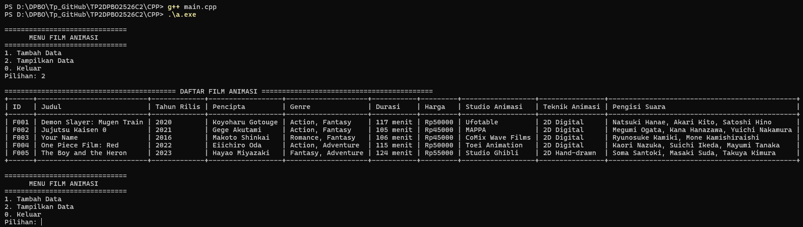

### Input / Tambah Data (CASE 1)

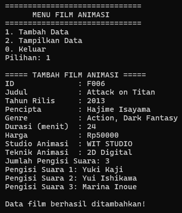

### Hasil Setelah Tambah Data


### Pengujian Error Handling

1. **CASE 2 - ID DUPLIKAT**

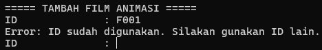

2. **CASE 3 - INPUT KOSONG**

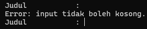

3. **CASE 4 - TAHUN RILIS DI LUAR BATAS**


4. **CASE 5 - TAHUN RILIS NEGATIF**

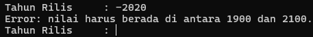

5. **CASE 6 - DURASI DI LUAR BATAS**


6. **CASE 7 - DURASI NEGATIF**


7. **CASE 8 - HARGA DI LUAR BATAS**


8. **CASE 9 - HARGA NEGATIF**


9. **CASE 10 - INPUT DURASI BUKAN ANGKA**


10. **CASE 11 - INPUT HARGA BUKAN ANGKA**


---

## Python

### Tampilan Awal dan 5 Object

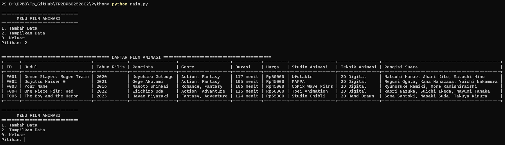

### Input / Tambah Data (CASE 1)


### Hasil Setelah Tambah Data


### Pengujian Error Handling

1. **CASE 2 - ID DUPLIKAT**


2. **CASE 3 - INPUT KOSONG**


3. **CASE 4 - TAHUN RILIS DI LUAR BATAS**

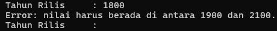

4. **CASE 5 - TAHUN RILIS NEGATIF**


5. **CASE 6 - DURASI DI LUAR BATAS**


6. **CASE 7 - DURASI NEGATIF**


7. **CASE 8 - HARGA DI LUAR BATAS**

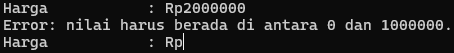

8. **CASE 9 - HARGA NEGATIF**


9. **CASE 10 - INPUT DURASI BUKAN ANGKA**

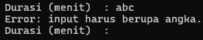

10. **CASE 11 - INPUT HARGA BUKAN ANGKA**


---

## Java

### Tampilan Awal dan 5 Object

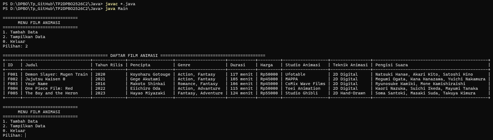

### Input / Tambah Data (CASE 1)


### Hasil Setelah Tambah Data

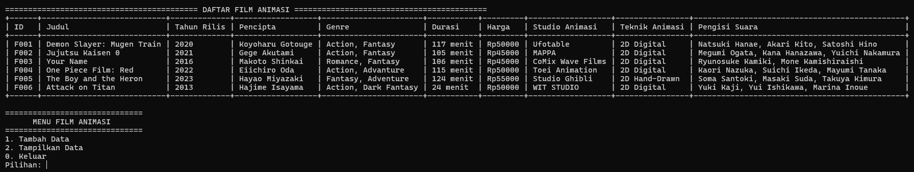

### Pengujian Error Handling

1. **CASE 2 - ID DUPLIKAT**


2. **CASE 3 - INPUT KOSONG**


3. **CASE 4 - TAHUN RILIS DI LUAR BATAS**


4. **CASE 5 - TAHUN RILIS NEGATIF**


5. **CASE 6 - DURASI DI LUAR BATAS**

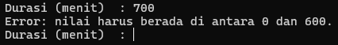

6. **CASE 7 - DURASI NEGATIF**

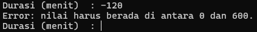

7. **CASE 8 - HARGA DI LUAR BATAS**


8. **CASE 9 - HARGA NEGATIF**

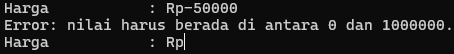

9. **CASE 10 - INPUT DURASI BUKAN ANGKA**


10. **CASE 11 - INPUT HARGA BUKAN ANGKA**

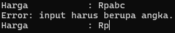

---

## PHP

### Tampilan Awal dan 5 Object

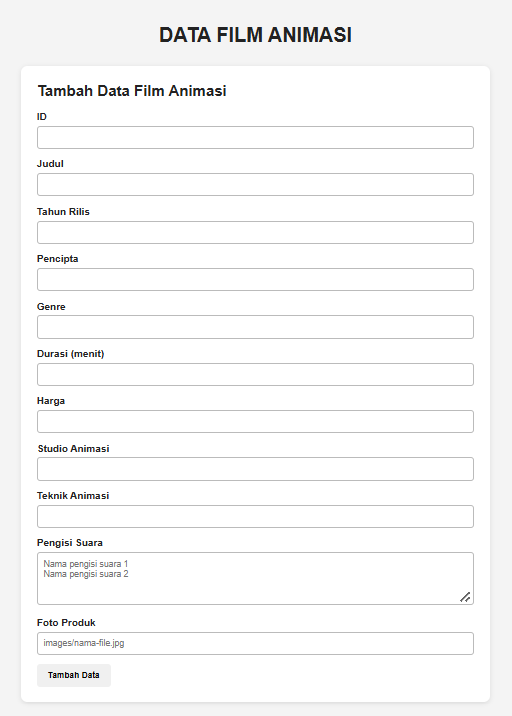
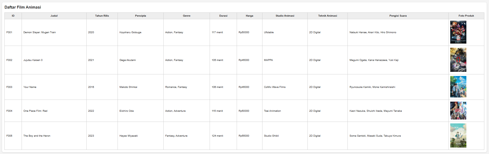

### Form Input / Tambah Data (CASE 1)

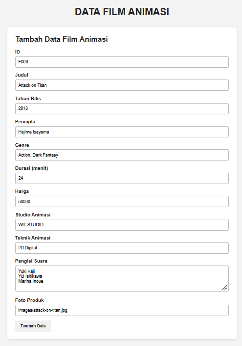

### Hasil Setelah Tambah Data

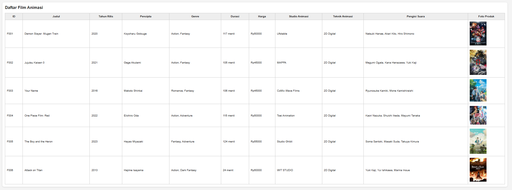

### Pengujian Error Handling

1. **CASE 2 - ID DUPLIKAT**

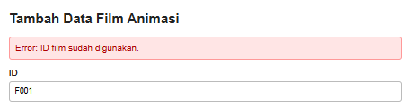

2. **CASE 3 - INPUT KOSONG**

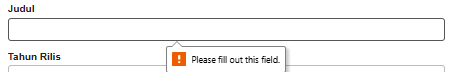

3. **CASE 4 - TAHUN RILIS DI LUAR BATAS**

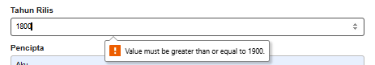

4. **CASE 5 - TAHUN RILIS NEGATIF**

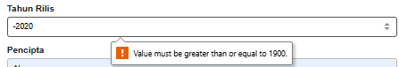

5. **CASE 6 - DURASI DI LUAR BATAS**

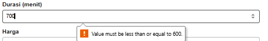

6. **CASE 7 - DURASI NEGATIF**

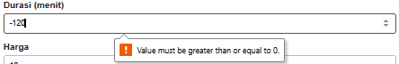

7. **CASE 8 - HARGA DI LUAR BATAS**

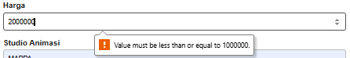

8. **CASE 9 - HARGA NEGATIF**

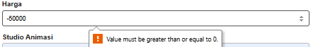

9. **CASE 10 - INPUT DURASI BUKAN ANGKA**

Tidak bisa mengetik selain angka.

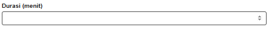

10. **CASE 11 - INPUT HARGA BUKAN ANGKA**

Tidak bisa mengetik selain angka.

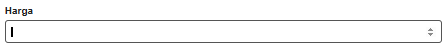

---

# Cara Menjalankan Program

## C++

Buka folder `CPP`, kemudian compile program menggunakan compiler C++.

Contoh:

```bash
g++ main.cpp -o main
```

Kemudian jalankan:

```bash
./main
```

Pada Windows:

```bash
main.exe
```

---

## Python

Buka folder `Python`, kemudian jalankan:

```bash
python main.py
```

---

## Java

Buka folder `Java`, kemudian compile:

```bash
javac KaryaSeni.java Film.java FilmAnimasi.java Main.java
```

Kemudian jalankan:

```bash
java Main
```

---

## PHP

1. Pastikan XAMPP sudah berjalan.
2. Jalankan Apache.
3. Letakkan folder project pada directory `htdocs`.
4. Buka browser.
5. Akses folder project melalui localhost.

Contoh:

```text
http://localhost/DPBO/TP2DPBO2526C2C/PHP/
```

**atau**

1. Buka folder `PHP`, kemudian buka terminal.
2. Ketik : **PHP -S localhost:8000**.
3. Salin link lalu buka di Browser.

---

# Struktur Repository

```text
TP2DPBO2526C2C/
│
├── CPP/
│   ├── KaryaSeni.cpp
│   ├── Film.cpp
│   ├── FilmAnimasi.cpp
│   ├── main.cpp
│   └── testcase.txt
│
├── Python/
│   ├── KaryaSeni.py
│   ├── Film.py
│   ├── FilmAnimasi.py
│   ├── main.py
│   └── testcase.txt
│
├── Java/
│   ├── KaryaSeni.java
│   ├── Film.java
│   ├── FilmAnimasi.java
│   ├── Main.java
│   └── testcase.txt
│
├── PHP/
│   ├── KaryaSeni.php
│   ├── Film.php
│   ├── FilmAnimasi.php
│   ├── index.php
│   ├── testcase.txt
│   └── images/
│       ├── demon-slayer.jpg
│       ├── jujutsu-kaisen-0.jpg
│       ├── your-name.jpg
│       ├── one-piece-red.jpg
│       └── the-boy-and-the-heron.jpg
│
├── Dokumentasi/
│   ├── TP2_diagram.png
│   ├── CPP.png
│   ├── Python.png
│   ├── Java.png
│   └── PHP.png
│
└── README.md
```

---

# Kesimpulan

Program TP2 merupakan pengembangan dari program TP1 dengan menerapkan konsep **Multilevel Inheritance**.

Ketiga class yang digunakan adalah:

```text
KaryaSeni
    ↓
  Film
    ↓
FilmAnimasi
```

Dengan desain tersebut, attribute yang bersifat umum ditempatkan pada class yang lebih tinggi, sedangkan attribute yang semakin spesifik ditempatkan pada class turunannya.

Program dibuat dalam C++, Python, Java, dan PHP serta dapat menerima input user untuk menambahkan data baru. Program juga menyediakan lima object awal, validasi input, error handling, dan tampilan seluruh data dalam satu tabel.
